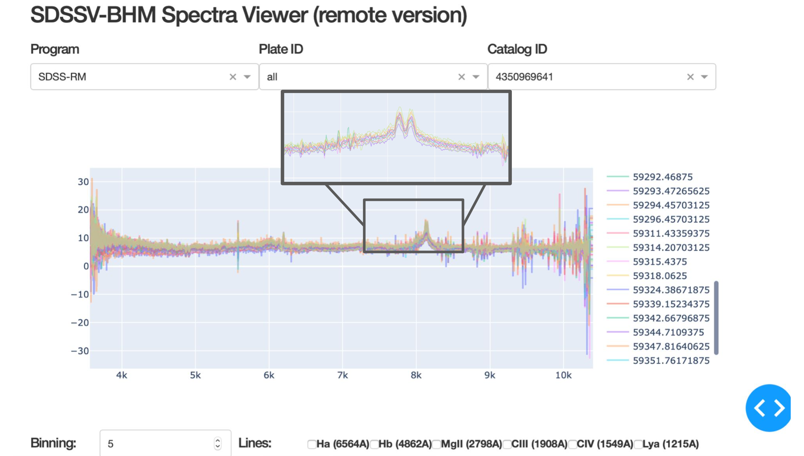

# SDSS_SpecViewer
authors: Dr. Jennifer Li (UIUC) and Meg Davis (UConn, megan.c.davis@uconn.edu), 2021

This is a demo for a multi-epoch spectral viewer for SDSSV-BHM using plotly/dash (https://dash.plotly.com/). The ultimate goal is to build a web application that allows quick spectral visualization for SDSSV BHM data. The current version will access the data via url and it takes 1-2 seconds to load each spectra.

**Usage**: Please see the Getting Started section, below, before launching the tool. To launch the web app, you run the script `sdssv_spec_appREMOTE.py` as a regular python file. The web app will be at http://127.0.0.1:8050/, which you can open with any web browser.

---
# Getting Started

### Authentication

You **must** edit the `authentication.txt` before running with the proper SDSS-V Proprietary Data username and password before running the tool. Please ensure that there are NO extra spaces after the username or password and that the username and password are on separate lines (i.e. just hit enter after the last character you type for the username and then type the password). The code will immediately check the authentication upon start up.

### Dependencies
Please install the following Python packages to use this tool. The provided "dependencies.sh" shell script will pip install these for you, if you run it with: `./dependencies.sh`.
-  dash
-  plotly
-  astropy
-  requests
-  numpy

### Keeping up-to-date

The `dictionaries.txt` file is the backbone to this tool. By running the `update_dictionaires.py` file, it will access the most recent `spAll_v6_0_2.fits` file and update said dictionary file. This doesn't need to be done often, especially once the plate programs are done observing. As of 7/20/2021, the file provided here is up-to-date! Runtime: ~10 minutes.

# Features to be added
- include previous spectra from SDSS I-IV, provide downloadable links to all data
- include quick links to other databases (Simbad, Ned, etc...)
- include source information summary (RA, Dec, z, source types...)
- search with RA/Dec for objects
- renormalization of spectra (based on specific wavelength or line)
- smoothing of spectra
- show the residual spectra in greyscale (could add as a second figure)
- optimize the loading speed
- add session history
- S/N selection slider bar
- Fix colors
